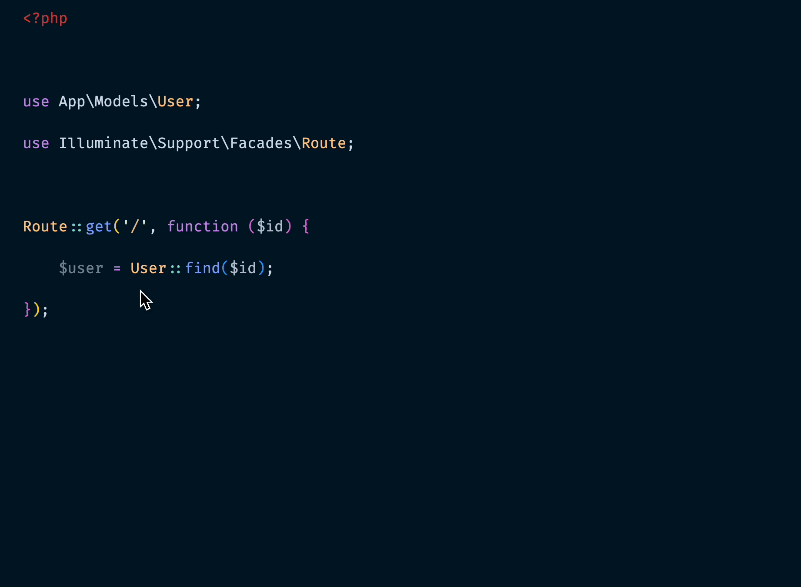

# Laravel Dumpman 🚀

A simple Laravel helper to insert `dd($variable);` quickly.

## Features
- Insert `dd($variable);` below the selected variable
- Works with function calls too
- Adds correct indentation automatically

## Installation
1. Open **VS Code**
2. Install via the **Extensions Marketplace**

## Usage
- Select a variable and press **F1**